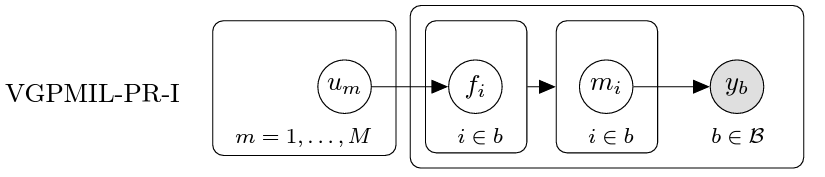

## Introducing instance label correlation in multiple instance learning. Application to cancer detection on histopathological images

This is the implementation for VGPMIL-PR-I proposed in our paper. 



To create an instance of the `vgpmil_probit_smooth` model: 
```
from kernel import RBF
from vgpmil_probit_smooth import vgpmil_probit_smooth

kernel_rbf = RBF(lengthscale=1.0, variance=1.0)
model = vgpmil_probit_smooth(kernel_rbf, sigma_m_0_inv=C)
```
where `C` is the $\mathbf{C}_b$ matrix in eq. (8) of the arXiv paper, exemplified in eq. (10). As explained in the paper, this matrix depends on the data and must be computed (only once) before training.

The model is initialized, trained and tested with the methods `initialize()`, `train()` and `predict()`, whose arguments can be found in the [source code](https://github.com/pablomorales92/vgpmil_pr_i/blob/master/vgpmil_probit_smooth.py).
 
The full reference of our work is 
```
@article{morales2024introducing,
  title={Introducing instance label correlation in multiple instance learning. Application to cancer detection on histopathological images},
  author={Morales-{\'A}lvarez, Pablo and Schmidt, Arne and Hern{\'a}ndez-Lobato, Jos{\'e} Miguel and Molina, Rafael},
  journal={Pattern Recognition},
  volume={146},
  pages={110057},
  year={2024},
  publisher={Elsevier}
}
```
